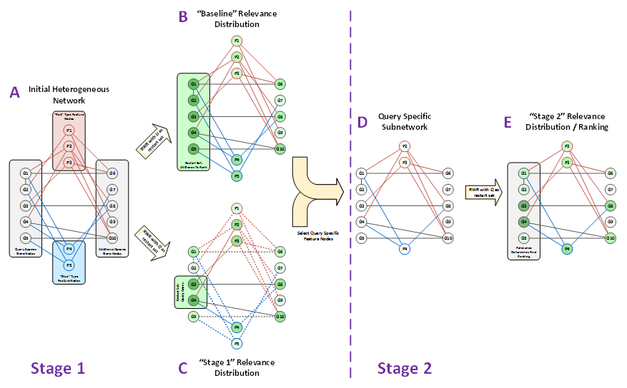

# *DRaWR* - Discriminative Random Walk with Restart
Charles Blatti [blatti@illinois.edu] and Saurabh Sinha  
KnowEnG BD2K Center of Excellence  
University of Illinois Urbana-Champaign  

## Table of Contents
1. [Motivation](#motivation)
2. [Installation](#installation)
3. [Tutorial](#tutorial)
    1. [Creating Gene Sets](#creating-gene-sets)
    2. [Building Heterogeneous Networks](#building-heterogeneous-networks)
    3. [Example DRaWR Runs](#example-drawr-runs)
4. [DRaWR Resources](#drawr-resources)
    1. [Function Parameters](#function-parameters)
    2. [Input File Formats](#input-file-formats)
    3. [Output File Formats](#output-file-formats)

## Motivation

Analysis of co-expressed gene sets typically involves testing for enrichment of different “properties” such as biological processes, pathways, transcription factor binding, etc., one property at a time. This approach ignores any known relationships among the properties or genes themselves. Previous work has sought to exploit these relationships by building biological networks that combine multiple types of gene-gene or gene-property relationships, and performing network analysis to identify other genes and properties most relevant to a given gene set. However, these existing network-based method often collapse information about individual property annotations to create simplified, homogeneous networks.

We present DRaWR, a network-based method for ranking genes or properties related to a given gene set. Such related genes or properties are identified from among the nodes of a large, heterogeneous network of biological information. Our method involves a random walk with restarts, performed on an initial network with multiple node and edge types, preserving more of the original, specific property information than current methods that operate on homogeneous networks. In this first stage of our algorithm, we find the properties that are the most relevant to the given gene set and extract a subnetwork of the original network, comprising only the relevant properties. We then rerank genes by their similarity to the given gene set, based on a second random walk with restarts, performed on the above subnetwork.



[Return to TOC](#table-of-contents)

## Installation

### Local copy of DRaWR repository

If you wish to use the sample files necessary to complete the tutorial or the datasets from the paper, first clone this repository from github:
```
git clone https://github.com/cblatti3/DRaWR.git
```

To use the 5 species networks from the paper, you must first unzip their contents:
```
gunzip networks/5ins_cdhmw.names.edge.gz
gunzip networks/5sp_adhiw.names.edge.gz
```

### DRaWR R Package Installation

The [DRaWR package](https://cran.r-project.org/web/packages/DRaWR/index.html) has been uploaded to the Comprehensive R Archive Network [CRAN](https://cran.r-project.org/index.html).  To install DRaWR, enter the R environment:
```
R
```

and use the standard R package installation method:
```
install.packages("DRaWR")
```
You will be prompted to select a local CRAN mirror to install from.  The DRaWR package and its dependancies will be automatically downloaded and installed.  Details on alternative methods for installing CRAN packages are available [here](https://cran.r-project.org/doc/manuals/r-release/R-admin.html). 

Every time you open R and wish to use the installed DRaWR library, load its functions with
```
library(DRaWR)
```

[Return to TOC](#table-of-contents)

## Tutorial

This section of the README is meant to walk a user through a process of using DRaWR to find related genes and features/properties that relate to a gene set (or sets) of interest.  In these examples, we will examine the sets of genes that are expressed in 12 specific spatial-temporal domains of the developing *Drosophila* embryo.   

### Creating Gene Sets

The first step is to create a file for each gene set that lists the members of that set.  This query [gene set file](#gene-set-file) format should list one gene name on each row.  
For example, the [Fly Brain Primordium Gene Set Query File](gene_sets/dmel/5268_brain_primordium.names.txt):
```
FBgn0008636
FBgn0040534
FBgn0040918
FBgn0041105
...
```

If the genes have distinct weights (e.g. different expression fold changes), a second column (separated by a tab) can be added.  Node weights must be positive with larger values meaning stronger evidence.  

For example:
```
FBgn0041156	5.2
FBgn0041186	1.3
FBgn0010105	2.6
```

We also must create a file that specifies the universe of genes we wish to rank that our query gene sets are a subset of.  Typically, this will be all of the genes on the species of interest. This is done with the same [gene set file](#gene-set-file) format above.  
For example, the *Drosophila* Universe File, [gene_sets/universes/dmel.ids.uni.txt](gene_sets/universes/dmel.ids.uni.txt):
```
FBgn0000032	1
FBgn0000289	1
FBgn0008636	1
FBgn0040505	1
...
```

Finally, we need a way to refer to all of the query gene set files we wish to example with DRaWR.  For this, we create a [gene set list](#gene-set-list).  This file must contain a line for each gene set with the location of that gene set file relative to the gene set list.  In the DRaWR repository, the 12 *Drosophila* Gene Set List, located at [setlists/dmel_possets12.list.txt](setlists/dmel_possets12.list.txt), so it contents must list the location of the gene set files relavtive to the setlists directory:
```
../gene_sets/dmel/2270_procephalic_ectoderm_anlage_in_statu_nascendi.names.txt
../gene_sets/dmel/4227_ventral_ectoderm_primordium.names.txt
../gene_sets/dmel/5155_ventral_epidermis_primordium.names.txt
../gene_sets/dmel/6069_embryonic_dorsal_epidermis.names.txt
```

### Building Heterogeneous Networks

We must also assemble a heterogeneous network before starting our DRaWR analysis.  This network will contain both gene nodes and property (feature) nodes as well as many different types of relationships connecting them.  To represent the network, we will use a [network edge file](#network-edge-file) format.  Each line in this file will represent an edge in our network.  The network edge file is expected to be a tab separated file with 4 columns [name of node 1, name of node 2, weight of edge/relationship, type of edge/relationship]. The edge weights must be positive with large values meaning stronger relationships. 

For example, from the hetergeneous drosophila network, [networks/dmel_cdhmw.names.edge](networks/dmel_cdhmw.names.edge), there are weighted gene<->gene (GG) edges representing protein sequence similarity.  The edge type is 'homol' and the larger weights indicate greater similarity.  
```
...
FBgn0040765	FBgn0000289	6.14	homol
FBgn0041105	FBgn0000289	2.32	homol
FBgn0042205	FBgn0000289	8.2	    homol
FBgn0043364	FBgn0000289	7.65	homol
...
```

To represent edges between a property node and a gene node, the property node must be listed as node 1. The second stage of DRaWR will select the most relavent property nodes based on the query genes. In the hetergeneous drosophila network, [networks/dmel_cdhmw.names.edge](networks/dmel_cdhmw.names.edge),, there are three types of property<->gene (PG) edges, each connecting multiple property nodes to their related genes.
```
...
mt_fkh_u5_gc    	FBgn0040717	3.17	motif_u5
mt_grh_u5_gc    	FBgn0040717	2.67	motif_u5
...
Pdom_Rad17	        FBgn0032244	5.26	pfam_domain
Pdom_Rep_fac_C	    FBgn0032244	8.2	    pfam_domain
...
chip_CAD_Bchip_s5	FBgn0033062	2.59	chip_binding
chip_EVE_Mseq_s14	FBgn0033062	2.66	chip_binding
...
```

DRaWR does not currently support edges between the property nodes.  We would recommend to limit the number of gene<->gene (GG) edge types in order to get the greatest improvements with the second stage of DRaWR.  Although edges from the network edge file are initially directional, by default, the network will be converted to an undirected, normalized by edge type adjacency matrix.  The maximum edge weights will be preserved if there are redundant edges.

### Example DRaWR Runs

Now that we have our gene sets and our network prepared, we are ready to run DRaWR.  Once in R, we must first load the DRaWR functions.
```
library(DRaWR)
```

To run our 12 gene set queries with the heterogenous *Drosophila* network with the default settings, the command requires that we specify the setlist ("possetfile"), the gene universe ("unifile"), the location of the heterogenous network ("networkfile"), the property-gene (PG) edge types, and a location for the outputs ("outdir").  We also will decide how many property nodes we wish to keep for each PG edge type ("st2keep") and the restart probability that we will use for our random walks ("restarts").  More details are available below for the [function parameters](#function-parameters).
```
DRaWR(possetfile = "setlists/dmel_possets12.list.txt",
    unifile = "gene_sets/universes/dmel.ids.uni.txt",
    networkfile = "networks/dmel_cdhmw.names.edge",
    property_types = c("motif_u5", "pfam_domain", "chip_binding"),
    outdir = "sample_results/",
    st2keep = 50, 
    restarts = c(0.3))
```

DRaWR will run. First it will make the network undirected, normalized, an remove redundant edges.  Then for each of our 12 query gene sets, it will read in the query set, run the 'baseline', 'stage 1', and 'stage 2' random walks with restart (RWR).  For each random walk, it will calcuate an Area Under the Reciever Operating Characteristics Curve (AUROC) using left out genes from the gene set as well as record the number of interations it took for the RWR to converge.  

DRaWR will by default produce two files in output directory.  The name of these files will contain a concatention of the arguments used to produce the run.  The first file is the converged probability distribution from the 'baseline' RWR.  This [prediction file](#prediction-file) ends with the suffix '.base'.  It contains a row for each node in the network and its four columns indicate the node name, the node type, the node's presence in the gene universe, and the probability of a 'baseline' walker being at that node.  

For example, we have the output from above, [sample_results/dmel.ids.uni.dmel_cdhmw.names.undir.weight.type.50.1e-04.0.3.base](sample_results/dmel.ids.uni.dmel_cdhmw.names.undir.weight.type.50.1e-04.0.3.base)
```
node            type    universe    baseline
FBgn0000008     -1      1           5.63872111193178e-05
FBgn0000014     -1      1           8.07988313120129e-05
FBgn0000015     -1      1           5.93092943412521e-05
FBgn0000017     -1      1           0.000112563218659276
FBgn0000018     -1      1           3.0293883832415e-05
FBgn0000022     -1      1           5.32024158248407e-05
...
```

The second output of DRaWR will be the performance of each RWR stage in ranking the left out genes from the query gene set.  This [prediction file](#prediction-file) ending in '.stats' contains summary information from each RWR stage, fold, RWR restart parameter, and query gene set completed by the DRaWR() call as well as the size of gene set, number of iterations, and AUROC metrics. 

From the example above, we output, [sample_results/dmel.ids.uni.dmel_cdhmw.names.undir.weight.type.50.1e-04.50.1.0.3.dmel_possets12.list.stats](sample_results/dmel.ids.uni.dmel_cdhmw.names.undir.weight.type.50.1e-04.50.1.0.3.dmel_possets12.list.stats)
```
network             direct  weight  normalize   uni             restart maxiters    thresh  st2keep posset                                                      nfolds  iter    stage       aucval  rwr_iters   ntrain
dmel_cdhmw.names    undir   weight  type        dmel.ids.uni    0.3     50          1e-04   50      2270_procephalic_ectoderm_anlage_in_statu_nascendi.names    1       1       baseline    0.667   0           13609
dmel_cdhmw.names    undir   weight  type        dmel.ids.uni    0.3     50          1e-04   50      2270_procephalic_ectoderm_anlage_in_statu_nascendi.names    1       1       stage1      1       17          222
dmel_cdhmw.names    undir   weight  type        dmel.ids.uni    0.3     50          1e-04   50      2270_procephalic_ectoderm_anlage_in_statu_nascendi.names    1       1       diff        1       0           222
dmel_cdhmw.names    undir   weight  type        dmel.ids.uni    0.3     50          1e-04   50      2270_procephalic_ectoderm_anlage_in_statu_nascendi.names    1       1       stage2      1       22          222
...
```

The default behavior of the DRaWR method is to do no cross-validation.  The performance values reported above is the training AUROC.  For a better estimate of performce, DRaWR should be run with cross validation.  To do this, the user just needs to specify the number of folds ('nfolds')

For example, 
```
DRaWR(possetfile = "setlists/dmel_possets12.list.txt",
    unifile = "gene_sets/universes/dmel.ids.uni.txt",
    networkfile = "networks/dmel_cdhmw.names.edge",
    property_types = c("motif_u5", "pfam_domain", "chip_binding"),
    outdir = "sample_results/",
    st2keep = 50, 
    restarts = c(0.3),
    nfolds = 10)
```

The default behavior of DRaWR is not to print out the converged probability distributions for the RWRs of each stage.  However, these values are necessary if one want to return the top ranked genes, or the most related property nodes.  To override the default behavior and produce the [prediction file](#prediction-file), you need to specify the 'writepreds' options.

```
DRaWR(possetfile = "setlists/dmel_possets12.list.txt",
    unifile = "gene_sets/universes/dmel.ids.uni.txt",
    networkfile = "networks/dmel_cdhmw.names.edge",
    property_types = c("motif_u5", "pfam_domain", "chip_binding"),
    outdir = "sample_results/",
    st2keep = 50, 
    restarts = c(0.3),
    writepreds = 1)
```

This produces a file ending in '.rwr' for each query gene set containing information about each node in the network after running DRaWR.  The 'baseline', 'stage1', and 'stage2' columns contain the converged RWR probabilies from each stage of DRaWR.  

Using our example, example above, we produce for one query set, [sample_results/dmel.ids.uni.dmel_cdhmw.names.undir.weight.type.50.1e-04.50.1.0.3.5268_brain_primordium.names.1.rwr](sample_results/dmel.ids.uni.dmel_cdhmw.names.undir.weight.type.50.1e-04.50.1.0.3.5268_brain_primordium.names.1.rwr)
```
node                    type            universe    baseline                train   test    stage1                  diff                    keep    stage2
FBgn0000008             -1              1           5.63872111193178e-05    0       0       2.9902923974918e-05     -2.64842871443998e-05   -1      9.09485166256704e-06
FBgn0000014             -1              1           8.07988313120129e-05    0       0       0.000118572506546682    3.77736752346694e-05    -1      0.000167470108206141
FBgn0000015             -1              1           5.93092943412521e-05    0       0       9.72564314976961e-05    3.7947137156444e-05     -1      0.000141947317124086
... 
chip_CAD_Bseq_s5        chip_binding    0           0.000714960664334332    0       0       0.00109212186511493     0.000377161200780602    1       0.00163031185472102
chip_CAD_Mchip_s5_9     chip_binding    0           0.000593923399913552    0       0       0.000847676120446827    0.000253752720533275    1       0.00136124484478671
chip_CHINMO_Mchip_s5_14 chip_binding    0           0.000380019396277925    0       0       0.000300343904418371    -7.96754918595537e-05   0       0
...
```

Sorting this table by 'stage2' in descending order shows the most important nodes (expect gene nodes in the query gene set 'train'=1 or 'test'=1 to show up near the top).  The 'keep' column indicates which property nodes were selected for the subnetwork used in stage two and sorting by the 'diff' column in descending order shows the ranking of feature nodes at the end of stage 1.

There are many other [function parameters](#function-parameters) that can be modified to run DRaWR and more details for these parameters are found below.

[Return to TOC](#table-of-contents)

## Resources

### Function Parameters
#### relating to input files
| Name           | Type    | Default  | Description                                                                                                                                                                                                                                                                             |
|----------------|---------|----------|-----------------------------------------------------------------------------------------------------------------------------------------------------------------------------------------------------------------------------------------------------------------------------------------|
| possetfile     | string  | required | location of file containing relative location of gene sets to test.                                                                                                                                                                                                                     |
| unifile        | string  | required | location of file listing gene universe.                                                                                                                                                                                                                                                 |
| networkfile    | string  | required | location of file containing network contents.                                                                                                                                                                                                                                           |
#### relating to output files
| Name           | Type    | Default  | Description                                                                                                                                                                                                                                                                             |
|----------------|---------|----------|-----------------------------------------------------------------------------------------------------------------------------------------------------------------------------------------------------------------------------------------------------------------------------------------|
| outdir         | string  | required | prefix of location of file to write performance results (optionally prediction results).                                                                                                                                                                                                |
| writepreds     | boolean | FALSE    | write predictions out to a file.                                                                                                                                                                                                                                                        |
| nfolds         | int     | 1        | number of folds for cross validation, Default is 1, no cross-validation.                                                                                                                                                                                                                |
#### relating to network processing
| Name           | Type    | Default  | Description                                                                                                                                                                                                                                                                             |
|----------------|---------|----------|-----------------------------------------------------------------------------------------------------------------------------------------------------------------------------------------------------------------------------------------------------------------------------------------|
| undirected     | bool    | TRUE     | boolean to make network undirected.                                                                                                                                                                                                                                                     |
| unweighted     | bool    | FALSE    | boolean to make network unweighted.                                                                                                                                                                                                                                                     |
| normalize      | string  | "type"   | type or "none" normalization method.                                                                                                                                                                                                                                                    |
| property_types | vector  | required | vector containing *ALL* names of property->gene (PG) edge_types. May contain PG edge_types that are not in the given network, but should not contain gene<->gene edge_types. Default is c("allen_brain_atlas", "chip_binding", "gene_ontology", "motif_u5", "pfam_domain", "T1", "T2"). |
| st2keep        | int     | 1        | number of property nodes to keep in second stage for each property type. To skip the second stage of DRaWR can set st2keep to 0.                                                                                                                                                        |
#### relating to random walks
| Name           | Type    | Default  | Description                                                                                                                                                                                                                                                                             |
|----------------|---------|----------|-----------------------------------------------------------------------------------------------------------------------------------------------------------------------------------------------------------------------------------------------------------------------------------------|
| restarts       | vector  | c(0.7)   | vector of restart values to test. Must be between 0 and 1.                                                                                                                                                                                                                              |
| maxiters       | int     | 50       | maximum number of allowable iterations.                                                                                                                                                                                                                                                 |
| thresh         | float   | 0.0001   | threshold for L1 norm convergence.                                                                                                                                                                                                                                                      |


### Input File Formats
#### Network Edge File
The network edge file is expected to be a 4 column, tab separated file. Each row represents and edge in the network and contains the values for:
*col1: node1 (string)
*col2: node2 (string)
*col3: edge_weight (float)
*col4: edge_type (string)

For edges between a property node and a gene node, the property node must be listed as node 1.  The order of the nodes does not matter for gene-gene edges.  The edge weights must be positive with large values meaning stronger relationships.  The second stage of DRaWR is intended to limit the property nodes from many different property->gene (PG) edge_types.  The number of gene<->gene (GG) edge_types should be limited.  By default the network edge file will be converted to an undirected, normalized by edge_type adjacency matrix with the edge weights taken as the maximum if there is repetition.

Example network edge file:
```
G1	G6	0.76	typeGG
G2	G1	0.41	typeGG
G2	G7	0.73	typeGG
G4	G5	0.89	typeGG
P1	G2	0.57	typePG.1
P1	G6	0.30	typePG.1
P2	G1	0.07	typePG.1
P2	G4	0.89	typePG.1
P3	G3	0.66	typePG.1
P3	G6	0.80	typePG.1
P4	G4	0.24	typePG.2
P4	G1	0.74	typePG.2
P5	G5	0.20	typePG.2
P5	G2	0.95	typePG.2
P5	G7	0.92	typePG.2
```

#### Gene Set File
The query gene set files or gene universe files should one node name listed on each row.  If the gene nodes have distinct weights, a second column (separated by a tab) can be added.  Node weights must be positive with larger values meaning stronger evidence.

Example gene set file:
```
G3  2.5
G4  1.3
G5  4.0
```

The gene universe file must contain the appropriate universe of genes that the genes in the query gene sets may be chosen from. Typically, this will be all of the genes on the species of interest.

#### Gene Set List
This file facilitates the examination of multiple gene sets with the identical settings of DRaWR.  The file must contain the location of a gene set file relative to itself on each line

Example gene set list:
```
../gene_sets/dmel/2270_procephalic_ectoderm_anlage_in_statu_nascendi.names.txt
../gene_sets/dmel/4227_ventral_ectoderm_primordium.names.txt
../gene_sets/dmel/5155_ventral_epidermis_primordium.names.txt
../gene_sets/dmel/6069_embryonic_dorsal_epidermis.names.txt
```

### Output File Formats
#### Statistics File
This file ending in '.stats' is produced to analyzing the performance results.

For every:
* stage ("stage1") of DRaWR
* fold ("iter") of cross validation
* RWR restart parameter ("restart") setting
* query gene set ("posset")

this file outputs on every line the settings of the DRaWR run as well as the:
* AUROC evaluation metric ("aucval")
* number of RWR interations ("rwr_iters")
* number of training examples ("ntrain")

#### Prediction File
This file ending in '.rwr' contains information about each node in the network after running DRaWR.  This file is only produced if writepreds = TRUE.  There is one row for each node in the network, and the columns are:
* "node": the name of that node
* "type": the type of that node, -1 if node is a gene node
* "universe": 1 if node in gene universe set, 0 otherwise
* "baseline": probability of being in the node from converged baseline RWR
* "train": 1 if node in the gene query set training set, 0 otherwise
* "test": 1 if node in the gene query set test set, 0 otherwise
* "stage1": probability of being in the node from converged stage1 RWR
* "diff": difference between "stage1" and "baseline"
* "keep": 1 if the property node was kept for the stage two RWR, 0 otherwise. -1 if node is a gene node
* "stage2": probability of being in the node from converged stage2 RWR

The file ending in '.base' contains the first 4 columns of the '.rwr' file and is used to accelerate the convergence of the RWRs.

[Return to TOC](#table-of-contents)